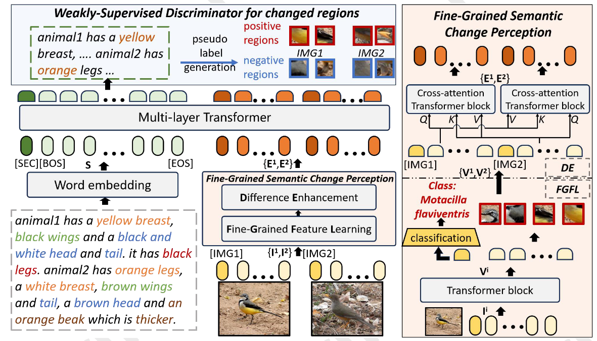
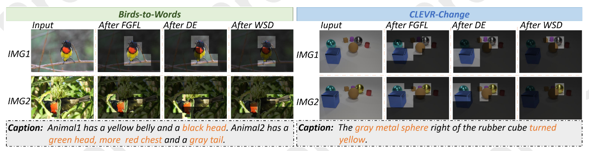

# F&P-IJCAI2025-OpenQuestions

"Find and Perceive: Tell Visual Change with Fine-Grained Comparison"  
IJCAI 2025 – Community Issue Tracker

This repository summarises the open questions I encountered while trying to reproduce the paper.
It **does NOT** provide code or checkpoints: independent re-implementations have so far failed to match the published metrics, and the authors **have NOT** replied to my **TWO** email requests for the original code and pretrained weights.
Below, I summarize the main challenges encountered during the review and reproduction process.

---

## Quick index
1. [Training-stage contradiction](#1-training-stage-contradiction)
2. [Framework diagram inconsistencies](#2-framework-diagram-inconsistencies)
3. [FGFL’s ad-hoc ground-truth assignment](#3-fgfls-ad-hoc-ground-truth-assignment)
4. [FGFL removal on Spot-the-Diff & Image-Editing-Request](#4-fgfl-removal-on-spot-the-diff--image-editing-request)
5. [Special tokens \[SEC\], \[BOS\], \[EOS\] never appear in pre-trained Word2Vec](#5-special-tokens-sec-bos-eos-never-appear-in-pre-trained-word2vec)
6. [Patch-level visualisations are synthetically regular](#6-patch-level-visualisations-are-synthetically-regular)
7. [Missing implementation details](#7-missing-implementation-details)
8. [Still no source code released](#8-still-no-source-code-released)

Below we expand on each point.

---

## 1. Training-stage contradiction  
§3.4 (Training and Inference) describes a **three-stage** pipeline:  
(1) three self-supervised tasks after [Yao et al., 2022] for cross-modal alignment;  
(2) joint training of FGFL & WSD;  
(3) full-model fine-tuning with change-caption ground truth.  

§4.2 (Implementation Detail) instead lists **four stages**:  
(1) same self-supervised tasks;  
(2) FGFL trained alone with classification labels;  
(3) first fine-tuning to generate WSD pseudo-labels (apparently from captions);  
(4) second fine-tuning with both pseudo-labels and caption ground truth.  

The paper never reconciles the two counts; the four-stage description in §4.2 looks more plausible, but without author clarification or code the conflict remains unresolved.

## 2. Framework diagram inconsistencies

In Figure 2-1 the overall framework draws image features **outside** the Fine-Grained Semantic Change Perception block, whereas the enlarged module view places them **inside**. 
The paper does not clarify whether this mismatch is a drawing error or an intentional design choice, leaving the actual data flow ambiguous.

## 3. FGFL’s ad-hoc ground-truth assignment
Training & Inference claims the label is “the classification result of the i-th image”, but §4.2 immediately splits into three incompatible settings: 
- CLEVR-Change: change-type label, computed from **single** image features  
- Birds-to-Words: bird-species label, full-image coarse class  
- Spot-the-Diff & Image-Editing-Request: FGFL removed, CLIP used instead

These three incompatible settings raise the following questions:  
1. Inconsistent ground truth across datasets may introduce evaluation bias.
2. CLEVR-Change predicts “change” from one frame, which contradicts the two-image difference objective.
3. Birds-to-Words uses species-level supervision, leaving it unclear whether such a coarse signal can improve perception of fine changes (feather colour, texture).

This dataset-varying patchwork (or outright removal) of labels makes the module’s contribution impossible to assess and suggests the reported gains may be mere dataset-specific tuning.

## 4. FGFL removal on Spot-the-Diff & Image-Editing-Request
The paper states that “fine-grained changes are scarce” in these two sets and therefore keeps only Difference Enhancement, dropping FGFL entirely.
Pending clarifications:
Surveillance-origin Spot-the-Diff often involves small objects (backpacks, traffic lights); Image-Editing-Request contains local edits (eyes, logos) besides global brightness shifts. It would be helpful to see the criteria or literature that indicate these changes are too coarse for FGFL.
FGFL acts as a Transformer feature extractor; even without classification labels the block could be retained (e.g., in an unsupervised mode). An ablation showing the impact of simply removing the classification head versus the whole module could clarify the design choice.
Human descriptions in both sets mention the changed object names and edit types, which could be parsed into labels. Sharing whether such pseudo-labels were explored or why they were deemed insufficient would assist reproduction efforts.
Until such details are provided, the decision to remove FGFL appears ad-hoc rather than evidence-based.

## 5. Special tokens [SEC], [BOS], [EOS] never appear in pre-trained Word2Vec
The manuscript inserts [SEC], [BOS] and [EOS] tokens around word2vec-encoded text. 
Because the original word2vec vocabulary does not contain these symbols, their initial vectors must have been created separately; 
the paper neither specifies the initialization method (random, trained from scratch, borrowed from another embedding table, etc.) nor indicates whether they were updated during training.

## 6. Patch-level visualisations are synthetically regular

Figure 6-1 presents attention maps as regular square patches, yet ResNet-101 does not natively produce such uniform grids. 
The paper does not describe how these patches were generated—whether via manual tiling, post-hoc interpolation, or another technique—and the corresponding code has not been released.

## 7. Missing implementation details
- Loss weights (λ₁, λ₂, …) **not given**.  
- Batch size, GPU Usage, etc. **all missing**.  
- Random-seed robustness **not reported**.  

## 8. Still no source code released
- First-author e-mails **unanswered** (request sent 2025-08-23, follow-up to all authors 2025-09-24; no reply received).  
- GitHub link **not provided** in camera-ready.  
- IJCAI policy encourages code release; authors ignored multiple requests.

---

We appreciate the authors' efforts and look forward to their clarifications on the above points. Providing the missing details—along with the complete code and checkpoints—will greatly facilitate reproducibility and further advancement of the field.

## Reference
[1] Image Difference Captioning with Pre-training and Contrastive Learning, AAAI 2022
